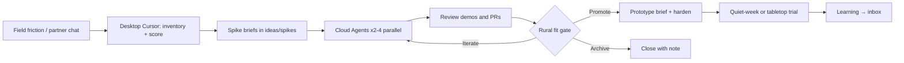

# Plan: Cursor + Cloud Agents for Rural/County EM Innovation

## Goal

Use Cursor (interactive) and Cloud Agents (parallel, autonomous) to systematically **discover problems**, **invent approaches**, **spike them cheaply**, and **ship small prototypes** that rural and county emergency management offices can actually use.

This is not a plan to build one big platform. It is a plan to run a continuous invention loop.

---

## Roles: what you do vs what the agents do

| You (human / EM domain) | Desktop Cursor | Cloud Agents |
|-------------------------|----------------|--------------|
| Name real friction from the field | Interview notes → structured briefs | Parallel idea variants |
| Decide what “good” means for a county | Debate scope, constraints, UX | Build runnable spikes + demos |
| Gate merge / field trials | Refine prompts and AGENTS.md | Open PRs with artifacts |
| Talk to partners / validate | Local exploration & editing | Overnight / offline work |

**Rule of thumb:** Frame on desktop. Ship spikes in the cloud. Never ask a Cloud Agent to invent policy or declare something “ready for a real incident” without a human gate.

---

## Phase 0 — Ground the problem space (1–2 sessions)

Before inventing tools, capture **jobs to be done** and **pain inventory**.

### What to capture (inbox notes)

For each friction point, write:

1. **Who** feels it (EM coordinator, 911, fire chief, public works, PIO, elected official, volunteer)
2. **When** it hurts (steady state / watch / activation / recovery)
3. **What they do today** (paper, radio, Excel, Facebook, phone tree, vendor portal)
4. **Cost of failure** (delay, duplicate effort, missed vulnerable populations, liability)
5. **Constraints** (no cell, no IT, must print, must work on a phone, HIPAA-ish caution, FOIA)

### Prompt starter (desktop)

> Act as a rural county EM staff of 2 covering 800+ sq mi. Interview me: ask 10 sharp questions about our worst weekly and worst activation-week workflows. Then produce a ranked friction inventory with “why current tools fail rural offices.”

Save outputs to `ideas/inbox/YYYY-MM-DD-friction-inventory.md`.

### Opportunity lenses (use these to stay novel, not generic)

Force every idea through at least one lens:

| Lens | Question |
|------|----------|
| **Thin staff** | Can one person complete this in under 5 minutes under stress? |
| **Distance** | Does it shrink drive time, radio loops, or “who has the latest map?” |
| **Offline** | Does it still help when the tower is down? |
| **Mutual aid** | Does it work across county lines without shared SaaS accounts? |
| **Paper hybrid** | Can it print cleanly or sync from a clipboard photo? |
| **Public trust** | Does it reduce rumor/alert fatigue without over-automating? |
| **Grant reality** | Can this be justified on a small EMPG/HMEP-style grant? |

Reject ideas that are basically “a nicer WebEOC for cities.”

---

## Phase 1 — Ideation sprints (desktop + optional parallel cloud)

### Cadence

Run short ideation sprints (not open-ended brainstorm forever):

1. Pick **one mission slice** (examples below)
2. Generate **8–12 ideas** constrained by Phase 0 inventory
3. Score them (template below)
4. Promote top 2–3 to spike briefs

### Mission slices (starter menu)

Use one slice per sprint so agents don’t invent vaporware platforms:

1. **Watch desk** — weather/intel → “so what for *this* county?”
2. **Resource status** — who’s available, what’s broken, where are the generators
3. **Vulnerable populations** — lists that stay current without becoming a database project
4. **Damage assessment** — windshield survey → usable county picture in hours, not days
5. **Public information** — accurate local updates that don’t fight Facebook rumors
6. **After-action / grants** — turn activation chaos into documentation without a second full-time job
7. **Volunteer / CERT** — tasking without Slack-style overhead
8. **Road/bridge/outage common operating picture** — shared truth across agencies with zero GIS staff
9. **Continuity for tiny offices** — if the EM is sick or unreachable, what still works?
10. **Training that sticks** — micro-drills that fit around other duties

### Scoring rubric (0–5 each)

- **Pain intensity** — how bad is the current state?
- **Rural fit** — works with thin staff / bad connectivity / low IT?
- **Novelty** — not a clone of metro/enterprise EM software?
- **Spikeability** — can a Cloud Agent demo something in one run?
- **Adoption path** — would a skeptical fire chief try it next week?

Promote ideas with high rural fit + spikeability first. Novelty without adoption is a dead end.

### Parallel ideation (Cloud Agents)

Once you have a friction inventory, you can launch 3 agents with the same inventory and different lenses, e.g.:

- Agent A: offline-first field tools
- Agent B: paperwork/automation that saves the EM coordinator hours
- Agent C: interagency coordination without new accounts

Ask each for ranked ideas + one “weird but promising” idea. Compare in desktop Cursor; do not merge ideation dumps wholesale — curate.

---

## Phase 2 — Spike briefs (the handoff artifact)

A spike is a **time-boxed experiment** with a demo definition of done. Write one markdown brief per spike in `ideas/spikes/`.

### Brief must include

1. Problem in one paragraph (rural-specific)
2. User and stressful moment
3. Hypothesis (“If we ___, then ___”)
4. In scope / out of scope
5. Success criteria (demo + what “good enough” looks like)
6. Non-goals (especially: not replacing 911 CAD, not a full EOC platform)
7. Stack preferences (simple: static site, SQLite, Google Sheets bridge, SMS, printable PDF)
8. Verification steps for the agent

Template: `ideas/spikes/TEMPLATE.md`

### What makes a good first spike

Prefer:

- Single-page tools, printable checklists with smart fill, SMS/email helpers, map overlays from open data, Excel/CSV in–CSV out, photo→structured notes

Avoid first:

- Multi-tenant SaaS, realtime GIS platforms, anything requiring county IT to open firewall ports, AI that “makes dispatch decisions”

---

## Phase 3 — Parallel Cloud Agent spikes

### How to launch

From [cursor.com/agents](https://cursor.com/agents) (or Desktop → Cloud):

1. Point at this repo
2. Paste a prompt from `docs/prompts/spike-agent.md` with the spike path filled in
3. Launch **2–4 agents** for high-value spikes — variants of approach, not vague “make something cool”
4. Require: branch + PR + screenshots/recording + short “how a rural EM would use this” note

### Prompt pattern that works

```
Goal: Implement the spike in ideas/spikes/<file>.md
Constraints: Follow AGENTS.md and rural constraints in README
Deliverable: Working demo, PR, screenshots or short recording
Verify: Run through the verification checklist in the spike brief
If blocked: Document the blocker in the PR and stop — do not invent fake county data policies
```

### Parallel strategy examples

For “windshield damage survey”:

| Agent | Approach |
|-------|----------|
| 1 | Mobile web form → printable county rollup PDF |
| 2 | Photo + voice note → structured CSV for Excel |
| 3 | Offline PWA with sync-when-online |

Review demos first, diffs second. Pick one line of attack; archive or close the rest.

### Environment note

As soon as spikes need runnable apps, add `.cursor/environment.json` (`install` / `start`) so agents boot ready to demo. Until then, static HTML/markdown spikes are fine.

---

## Phase 4 — Human review gate

Before promoting a spike:

1. **Would a 2-person EM office use this under stress?**
2. **Does it create new work (data entry theater)?**
3. **Does it fail gracefully offline / on a phone?**
4. **Is the language plain and localizable to county procedures?**
5. **Can we trial it without procurement?**

Outcomes:

- **Promote** → `ideas/prototypes/` + follow-up agent to harden
- **Iterate** → comments on the PR / follow-up message to the same agent
- **Archive** → leave PR closed with a one-line “why not”

Never declare a tool incident-ready from an agent demo alone. Field tabletop or quiet-week trial first.

---

## Phase 5 — Prototype → trial → learn

Promoted prototypes get:

1. A build brief (`ideas/prototypes/TEMPLATE.md`)
2. Minimal docs a county partner can follow
3. A feedback form (5 questions max)
4. A kill criteria (“if unused after 2 activations / 30 days of watch season, shelve”)

Use Cloud Agents for polish, test fixtures, and packaging. Use desktop Cursor for partner-facing wording and procedure fit.

Log learnings back into `ideas/inbox/` so the factory improves.

---

## Recommended first 5 spikes (seed list)

These are intentionally narrow and rural-shaped — use or replace after your friction inventory:

1. **County “So What?” weather brief** — NWS/hazard inputs → 1-page local actions for *this* county’s roads, rivers, and facilities
2. **Resource status board that prints** — generator/shelter/fuel/staff status as a single printable + phone-updatable sheet
3. **Windshield survey pack** — phone form → CSV + map pins + printable rollup for elected officials
4. **Activation timeline logger** — one-tap logging that later exports after-action and grant narrative scraps
5. **Mutual-aid contact/check-in sheet** — works when the shared Google Doc is chaos; SMS-friendly

Each can be spiked by a Cloud Agent as a static or lightly-backed tool without inventing a platform.

---

## Cursor workflow map



### Desktop Cursor habits

- Keep `AGENTS.md` and spike briefs accurate — that is the agent’s brain
- Use Plan mode when scoping; Agent mode when writing briefs
- Prefer rules for tone (“plain language, no metro EM assumptions”)

### Cloud Agent habits

- One spike per agent run when possible
- Demand artifacts (screenshot/video)
- Prefer follow-ups on the winning PR over restarting
- Use secrets/egress only when a spike truly needs live APIs

### Optional automations (later)

- Weekly digest of open spike PRs
- Slack → “spike this inbox note”
- CI autofix on prototype PRs

Skip automations until the loop works manually.

---

## Success metrics for *this process* (not for a product)

Track whether the factory works:

- Friction notes captured per month
- Spikes launched / demos reviewed
- Promotions to prototype
- Partner trials started
- Ideas killed quickly (killing is success)
- Hours of EM staff time saved in trials (ask directly)

---

## Immediate next actions

1. Fill one friction inventory in `ideas/inbox/` (desktop interview prompt above)
2. Score and pick 2 seed spikes from the list (or from inventory)
3. Write spike briefs using the template
4. Launch parallel Cloud Agents with `docs/prompts/spike-agent.md`
5. Hold a 30-minute demo review; promote or kill
6. When you have a runnable app spike, add `.cursor/environment.json`

---

## Anti-patterns

- Building a “rural WebEOC”
- Letting agents invent county policy or fake legal compliance
- Scoring novelty above adoptability
- Spikes with no verification checklist
- Dashboards that need a full-time watcher
- Tools that require every mutual-aid partner to create accounts before the storm
